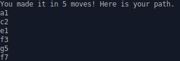

# Knight's Travails

This is a challenge whose solution makes use of the graph data structure.

### Background

The knight is a piece in chess that looks like a horse. The knight is only capable of moving in a specific fashion. It must move in a shape that looks like an uppercase L.

With this moveset, the knight is capable of reaching any space on the chess board even if it takes many moves.

### The Assignment From The Odin Project

"Your task is to build a function knight_moves that shows the shortest possible way to get from one square to another by outputting all squares the knight will stop on along the way."

### The Output

